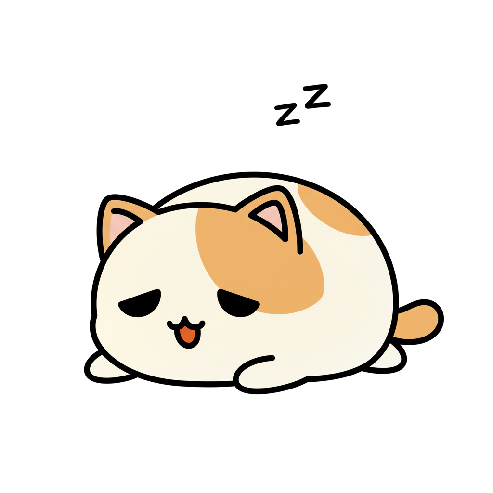
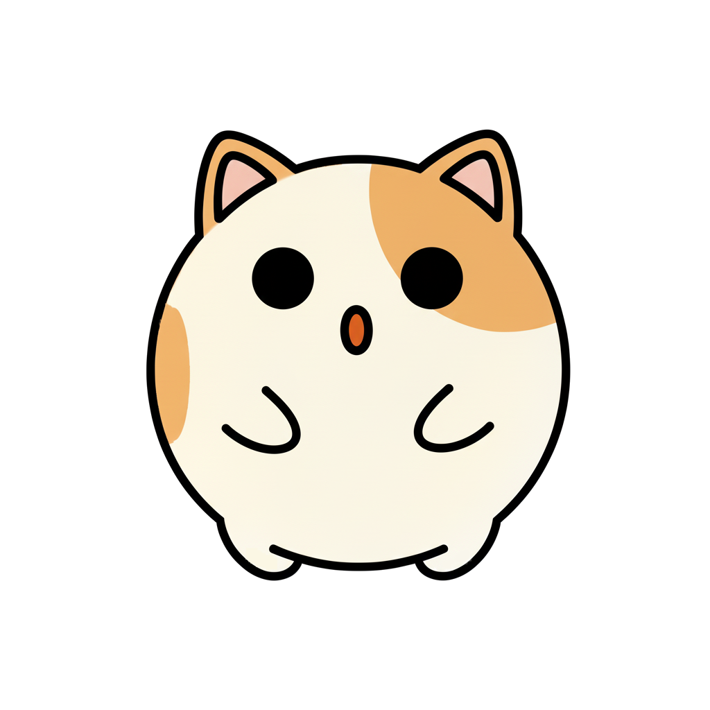

# PeacePal 🕊️

**Your Personal Stress Relief Companion**


[🌐 Vietnamese Version](README.vi.md)

---


---

## 📖 About PeacePal

**PeacePal** is a simple mobile app for stress relief and mood tracking. It includes some minigames, a daily diary, and task management to help you relax and stay organized.

This is a personal project made for learning and sharing. Feel free to try it out if you're looking for a simple way to take breaks and track your mood.

---

## ✨ Features

- 🐾 **Mascot Companion** - A character that shows different emotions
- 🏠 **5 Rooms** - Living Room, Garden, Aquarium, Painting Room, Music Room
- 🎮 **Minigames** - Plant a garden, care for fish, draw pixel art, compose music
- 📔 **Emotion Diary** - Track your daily mood with simple questions
- ✅ **Task Manager** - Keep track of your daily tasks
- 🎨 **Customization** - 8 themes, 5 scene sets (unlock with points), 2 languages
- 🎵 **Background Music** - 8 lofi/relaxing tracks you can play while using the app
- ☁️ **Cloud Sync** - Save your progress online (requires account)

---

## 🐾 Meet Your Companion

The mascot shows different emotions depending on what you're doing in the app.

<p align="center">
  
  
  
  
  
  
</p>

---

## 🎮 Minigames & Activities

### 🌱 Garden

Plant and harvest virtual crops.

- 10 different plant types with varying growth times (40-140 hours)
- Water every 20 hours to keep them growing
- Occasional pests may appear
- Earn points when you harvest

### 🐠 Aquarium

Keep and feed virtual fish.

- Up to 10 fish
- Feed them regularly to earn points
- Fish swim in different themed backgrounds

### 🎨 Painting Room

Draw simple pixel art.

- 64×64 pixel canvas
- Basic color palettes
- Templates available (Heart, Star, Flower, Cat, Tree, Apple)
- Save your drawings to a gallery

### 🎵 Music Room

Create simple music tracks.

- 5 instruments: Piano, Guitar, Bass, Drum, Synth
- Basic music composition interface
- Save your tracks to a library
- Sample tracks included

---

## 📔 Daily Tools

### Emotion Diary

Track your mood each day:

- 3 simple questions rated 1-5
- Optional notes
- View past entries
- Data is encrypted and stored locally/cloud

### Task Manager

Basic task tracking:

- Create daily tasks
- Set start/end times
- Optional reminders
- Mark tasks as complete
- Recurring tasks supported

---

## 🎨 Customization

### 8 Themes

4 light and 4 dark themes:

**Light Themes:**
- 🌊 Pastel Blue Breeze (Default)
- 💜 Calm Lavender
- ☀️ Sunny Pastel Yellow
- 🌿 Minty Fresh

**Dark Themes:**
- 🌙 Midnight Blue
- 🌸 Soft Purple Night
- 🌅 Warm Sunset
- 🌲 Serene Green Night

### 5 Scene Sets

Unlock with points earned from minigames:

1. **Default** (Free)
2. **Japanese Style**
3. **Beach/Tropical**
4. **Winter/Snow**
5. **Forest/Nature**

Each set has different backgrounds for all 5 rooms.

### Language Support

- 🇬🇧 English
- 🇻🇳 Tiếng Việt

---

## 🎵 Audio

### Background Music

8 tracks you can play:
- Lofi Beats
- Rain Sounds
- Piano Music
- Acoustic Ballad
- Folk Song
- Indie Vibes
- Soft Pop
- Chill Acoustic

### Sound Effects

Basic sounds for buttons, task completion, etc.

### Controls

- Separate volume controls for music and sound effects
- Can turn each on/off independently

---

## 📱 Installation

### System Requirements

- **Platform:** Android 5.0+ (API level 21+)
- **Storage:** ~250MB free space
- **Internet:** Required for account creation and cloud sync

### Quick Start

Download the APK from GitHub Release to use on mobile decive.

### Building from Source

If you want to build it yourself:

```bash
# Clone the repository
git clone https://github.com/[your-username]/peacepal.git
cd stress_relief_app

# Install Flutter dependencies
flutter pub get

# Generate Hive adapters (if needed)
flutter pub run build_runner build

# Run on connected device or emulator
flutter run

# Build release APK
flutter build apk --release
```

**Prerequisites:**
- Flutter SDK (Latest stable)
- Dart 3.9.2+
- Android SDK
- Firebase project setup (for cloud features)

---

## 📚 Usage

### First Time Setup

1. Create an account (or skip to use offline)
2. Name your mascot
3. Pick a theme
4. Go through the tutorial

### How to Use

- Use the emotion diary to track your mood
- Add tasks to stay organized
- Play minigames when you want a break
- Water garden plants every 20 hours if you're playing that
- Earn points to unlock new scenes

### Tips

- Set phone reminders if you want to remember to water plants
- Enable notifications for task reminders if needed
- Try different themes to see what you like

---

## 🛠️ Tech Stack

- **Flutter** - Mobile app framework
- **Firebase** - Cloud authentication and sync
- **Hive** - Local database
- **Material Design 3** - UI design
- **Provider** - State management

---

## 🤝 Support & Feedback

### Need Help?

- 🐛 **Bug Reports** - [GitHub Issues](https://github.com/[your-username]/peacepal/issues)
- 💡 **Feature Requests** - [GitHub Issues](https://github.com/[your-username]/peacepal/issues)
- 📧 **Email** - [your.email@example.com]

### Contributing

This is a personal learning project. Feel free to open an issue if you find bugs or have suggestions.

---

## 📄 License

This project is licensed under the **Creative Commons Attribution-NonCommercial 4.0 International License (CC BY-NC 4.0)**.

**This means:**
- ✅ You can use, share, and modify this app for **personal, educational, or non-commercial purposes**
- ✅ You must give appropriate credit to the original author
- ❌ You **cannot** use this app or its code for **commercial purposes** without permission

See the [LICENSE](LICENSE) file for full details or visit [CC BY-NC 4.0](https://creativecommons.org/licenses/by-nc/4.0/).

---

## 🙏 Acknowledgments

- Built as a learning project
- Thanks to the Flutter and Firebase communities for documentation and resources

---

## 🌟 Possible Future Updates

Some ideas I might add later (no promises):

- Web version
- iOS version
- Achievement system
- Emotion tracking charts
- More minigames or features

---

<p align="center">
  A simple stress relief app made for learning and sharing.
</p>
