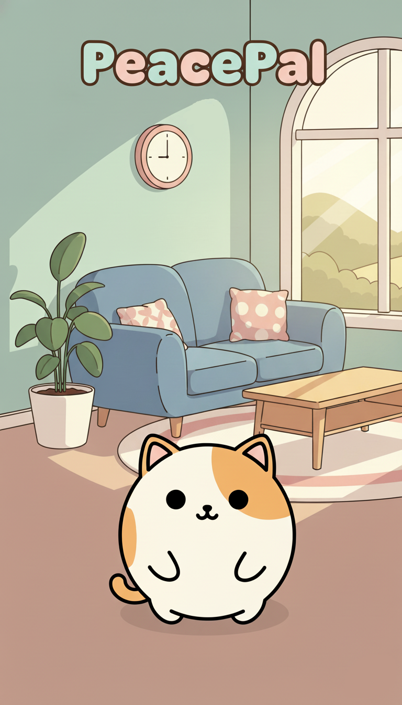
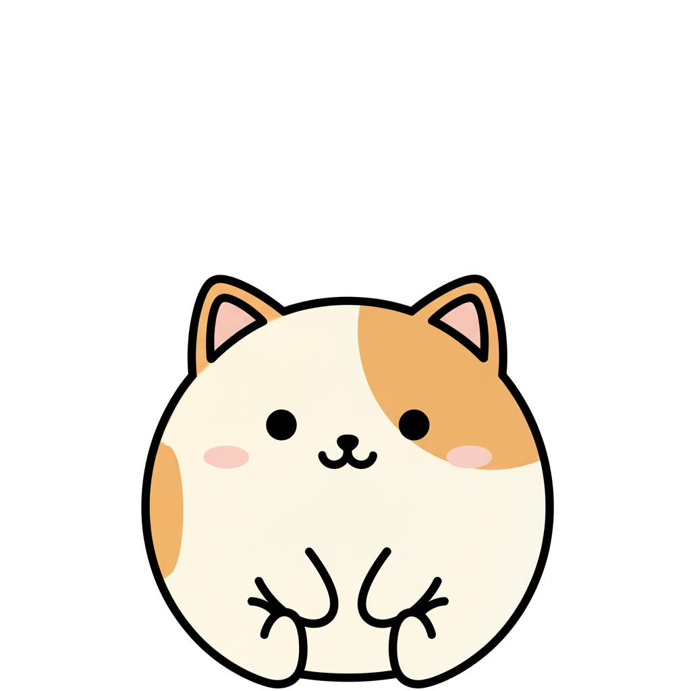

# PeacePal 🕊️

**Người Bạn Đồng Hành Giảm Stress Của Bạn**


[🇬🇧 English Version](README.md)

---



---

## 📖 Giới Thiệu PeacePal

**PeacePal** là ứng dụng di động đơn giản giúp giảm stress và theo dõi tâm trạng. Ứng dụng có một số minigame, nhật ký hàng ngày và quản lý công việc để bạn thư giãn và sắp xếp thời gian.

Đây là dự án cá nhân được làm để học tập và chia sẻ. Bạn có thể thử nếu đang tìm cách đơn giản để nghỉ ngơi và ghi lại tâm trạng.

---

## ✨ Tính Năng

- 🐾 **Linh Vật** - Nhân vật hiển thị các cảm xúc khác nhau
- 🏠 **5 Phòng** - Phòng Khách, Vườn, Hồ Cá, Phòng Vẽ, Phòng Nhạc
- 🎮 **Minigame** - Trồng cây, chăm sóc cá, vẽ pixel art, sáng tác nhạc
- 📔 **Nhật Ký Cảm Xúc** - Theo dõi tâm trạng hàng ngày với câu hỏi đơn giản
- ✅ **Quản Lý Công Việc** - Ghi lại công việc hàng ngày
- 🎨 **Tùy Chỉnh** - 8 theme, 5 bộ cảnh (mở khóa bằng điểm), 2 ngôn ngữ
- 🎵 **Nhạc Nền** - 8 bản nhạc lofi/thư giãn có thể phát khi dùng app
- ☁️ **Đồng Bộ** - Lưu tiến trình online (cần tài khoản)

---

## 🐾 Gặp Gỡ Linh Vật

Linh vật hiển thị các cảm xúc khác nhau tùy theo bạn đang làm gì trong app.

<p align="center">
  
  
  
  
  
  
</p>

---

## 🎮 Minigame & Hoạt Động

### 🌱 Vườn Cây

Trồng và thu hoạch cây ảo.

- 10 loại cây với thời gian sinh trưởng khác nhau (40-140 giờ)
- Tưới nước mỗi 20 giờ để cây lớn
- Thỉnh thoảng có sâu bệnh
- Kiếm điểm khi thu hoạch

### 🐠 Hồ Cá

Nuôi và cho cá ăn.

- Tối đa 10 con cá
- Cho ăn đều đặn để kiếm điểm
- Cá bơi trong các cảnh nền khác nhau

### 🎨 Phòng Vẽ

Vẽ pixel art đơn giản.

- Khung vẽ 64×64 pixel
- Bảng màu cơ bản
- Có mẫu sẵn (Trái Tim, Ngôi Sao, Hoa, Mèo, Cây, Táo)
- Lưu tranh vào thư viện

### 🎵 Phòng Nhạc

Tạo bản nhạc đơn giản.

- 5 nhạc cụ: Piano, Guitar, Bass, Trống, Synth
- Giao diện sáng tác cơ bản
- Lưu bản nhạc vào thư viện
- Có bản nhạc mẫu

---

## 📔 Công Cụ Hàng Ngày

### Nhật Ký Cảm Xúc

Theo dõi tâm trạng mỗi ngày:

- 3 câu hỏi đơn giản đánh giá 1-5
- Ghi chú tùy chọn
- Xem lại các mục cũ
- Dữ liệu được mã hóa và lưu local/cloud

### Quản Lý Công Việc

Theo dõi công việc cơ bản:

- Tạo công việc hàng ngày
- Đặt thời gian bắt đầu/kết thúc
- Nhắc nhở tùy chọn
- Đánh dấu hoàn thành
- Hỗ trợ công việc lặp lại

---

## 🎨 Tùy Chỉnh

### 8 Theme

4 theme sáng và 4 theme tối:

**Theme Sáng:**
- 🌊 Pastel Blue Breeze (Mặc định)
- 💜 Calm Lavender
- ☀️ Sunny Pastel Yellow
- 🌿 Minty Fresh

**Theme Tối:**
- 🌙 Midnight Blue
- 🌸 Soft Purple Night
- 🌅 Warm Sunset
- 🌲 Serene Green Night

### 5 Bộ Cảnh

Mở khóa bằng điểm kiếm từ minigame:

1. **Mặc Định** (Miễn phí)
2. **Phong Cách Nhật Bản**
3. **Bãi Biển/Nhiệt Đới**
4. **Mùa Đông/Tuyết**
5. **Rừng/Thiên Nhiên**

Mỗi bộ có hình nền khác nhau cho cả 5 phòng.

### Hỗ Trợ Ngôn Ngữ

- 🇬🇧 English (Tiếng Anh)
- 🇻🇳 Tiếng Việt

---

## 🎵 Âm Thanh

### Nhạc Nền

8 bản nhạc có thể phát:
- Lofi Beats
- Tiếng Mưa
- Nhạc Piano
- Ballad Acoustic
- Dân Ca
- Indie Vibes
- Soft Pop
- Chill Acoustic

### Hiệu Ứng Âm Thanh

Âm thanh cơ bản cho nút bấm, hoàn thành công việc, v.v.

### Điều Khiển

- Chỉnh âm lượng riêng cho nhạc và hiệu ứng
- Bật/tắt độc lập

---

## 📱 Cài Đặt

### Yêu Cầu Hệ Thống

- **Nền tảng:** Android 5.0+ (API level 21+)
- **Dung lượng:** ~250MB dung lượng trống
- **Internet:** Cần thiết cho tạo tài khoản và đồng bộ đám mây

### Bắt Đầu Nhanh

Tải APK từ GitHub Release để dùng trên thiết bị di động.

### Build Từ Mã Nguồn

Nếu muốn tự build:

```bash
# Clone repository
git clone https://github.com/[your-username]/peacepal.git
cd stress_relief_app

# Cài đặt dependencies Flutter
flutter pub get

# Tạo Hive adapters (nếu cần)
flutter pub run build_runner build

# Chạy trên thiết bị hoặc emulator
flutter run

# Build APK release
flutter build apk --release
```

**Yêu cầu:**
- Flutter SDK (Phiên bản stable mới nhất)
- Dart 3.9.2+
- Android SDK
- Thiết lập Firebase project (cho tính năng đám mây)

---

## 📚 Hướng Dẫn

### Thiết Lập Lần Đầu

1. Tạo tài khoản (hoặc bỏ qua để dùng offline)
2. Đặt tên cho linh vật
3. Chọn theme
4. Xem hướng dẫn

### Cách Sử Dụng

- Dùng nhật ký cảm xúc để ghi lại tâm trạng
- Thêm công việc để sắp xếp
- Chơi minigame khi muốn nghỉ ngơi
- Tưới cây vườn mỗi 20 giờ nếu đang chơi
- Kiếm điểm để mở khóa cảnh mới

### Mẹo

- Đặt nhắc nhở trên điện thoại nếu muốn nhớ tưới cây
- Bật thông báo cho công việc nếu cần
- Thử các theme khác nhau để xem cái nào hợp

---

## 🛠️ Công Nghệ

- **Flutter** - Framework ứng dụng di động
- **Firebase** - Xác thực và đồng bộ đám mây
- **Hive** - Cơ sở dữ liệu local
- **Material Design 3** - Thiết kế UI
- **Provider** - Quản lý state

---

## 🤝 Hỗ Trợ & Phản Hồi

### Cần Giúp Đỡ?

- 🐛 **Báo Lỗi** - [GitHub Issues](https://github.com/[your-username]/peacepal/issues)
- 💡 **Đề Xuất Tính Năng** - [GitHub Issues](https://github.com/[your-username]/peacepal/issues)
- 📧 **Email** - [your.email@example.com]

### Đóng Góp

Đây là dự án học tập cá nhân. Bạn có thể mở issue nếu tìm thấy lỗi hoặc có đề xuất.

---

## 📄 Giấy Phép

Dự án này được cấp phép theo **Giấy phép Creative Commons Ghi công-Phi thương mại 4.0 Quốc tế (CC BY-NC 4.0)**.

**Điều này có nghĩa:**
- ✅ Bạn có thể sử dụng, chia sẻ và chỉnh sửa ứng dụng này cho **mục đích cá nhân, giáo dục hoặc phi thương mại**
- ✅ Bạn phải ghi công tác giả gốc
- ❌ Bạn **không được** sử dụng ứng dụng này hoặc mã nguồn của nó cho **mục đích thương mại** mà không có sự cho phép

Xem file [LICENSE](LICENSE) để biết chi tiết đầy đủ hoặc truy cập [CC BY-NC 4.0](https://creativecommons.org/licenses/by-nc/4.0/).

---

## 🙏 Lời Cảm Ơn

- Được làm như một dự án học tập
- Cảm ơn cộng đồng Flutter và Firebase về tài liệu và nguồn tài nguyên

---

## 🌟 Có Thể Cập Nhật Sau

Một số ý tưởng có thể thêm sau (không cam kết):

- Phiên bản Web
- Phiên bản iOS
- Hệ thống thành tích
- Biểu đồ theo dõi cảm xúc
- Thêm minigame hoặc tính năng

---

<p align="center">
  Ứng dụng giảm stress đơn giản được làm để học tập và chia sẻ.
</p>
