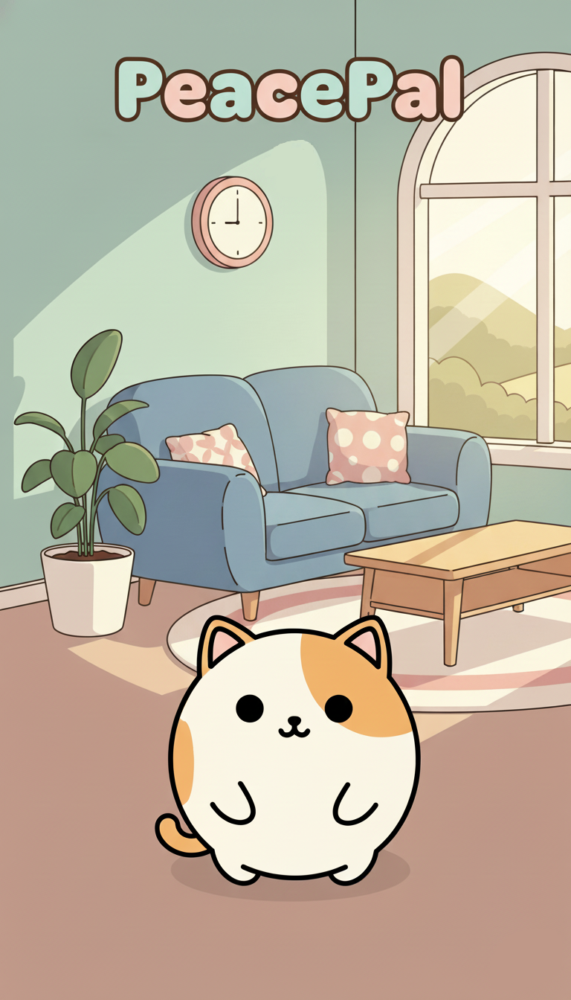

# PeacePal

**Ứng dụng gamification giúp bạn xây dựng thói quen tốt mỗi ngày.**


[🇬🇧 English](README.md)

---



---

## Tính Năng

- 🐾 **Linh Vật** — Người bạn đồng hành với nhiều cảm xúc, phản ứng theo tâm trạng của bạn
- 🏠 **5 Phòng** — Phòng Khách, Vườn Cây, Hồ Cá, Phòng Vẽ, Phòng Nhạc
- 📔 **Công Cụ Hàng Ngày** — Nhật ký cảm xúc, quản lý công việc, luyện thở, ghi chú giấc ngủ
- 🎮 **Minigame Solo** — Trồng cây, nuôi cá, vẽ pixel art, soạn giai điệu
- 🤝 **Trò Chơi Hợp Tác** — Chơi cùng bạn bè, không cần đăng nhập
- 🏆 **Thành Tích** — Mở khóa huy hiệu qua các hoạt động hàng ngày
- 🎨 **Tùy Chỉnh** — 8 theme, 8 bộ cảnh, 2 ngôn ngữ
- 🎵 **Nhạc Nền** — 8 bản nhạc lofi/thư giãn
- ☁️ **Đồng Bộ** — Tùy chọn tài khoản để lưu tiến trình online

---

## Các Phòng & Hoạt Động

### Phòng Khách

Trung tâm hàng ngày của bạn. Quản lý danh sách công việc, ghi lại tâm trạng, luyện thở và xây dựng thói quen ngủ tốt hơn.

### Vườn Cây & Hồ Cá

Chăm sóc cây ảo hoặc nuôi cá để tích lũy điểm thưởng. Tưới cây mỗi 20 giờ, cho cá ăn đều đặn. Dùng điểm để mở khóa bối cảnh phòng mới tại Cửa Hàng Bối Cảnh.

### Phòng Vẽ

Vẽ trên khung 64×64 pixel với bảng màu và các mẫu có sẵn. Lưu tranh vào thư viện cá nhân.

### Phòng Nhạc

Soạn giai điệu với 5 nhạc cụ (Piano, Guitar, Bass, Trống, Synth). Lưu bản nhạc vào thư viện hoặc nghe các bản nhạc mẫu đi kèm.

---

## Trò Chơi Hợp Tác

Cùng chơi hợp tác với bạn bè — không cần đăng nhập. Ba trò chơi:

- **Xếp Đá** — Cân bằng tháp đá cùng nhau
- **Bắt Đom Đóm** — Hợp tác bắt đom đóm
- **Thuyền Giấy** — Cùng đưa thuyền giấy ngược dòng

**Di động:** Kết nối cùng mạng Wi-Fi, tạo hoặc tham gia phòng.

**Web:** Chia sẻ mã phòng — bạn bè có thể tham gia từ bất kỳ đâu, không cần cùng mạng.

---

## Tùy Chỉnh

**8 Theme** — 4 theme sáng (Pastel Blue, Lavender, Sunny Yellow, Minty) và 4 theme tối (Midnight Blue, Purple Night, Warm Sunset, Green Night).

**8 Bộ Cảnh** — Mặc định (miễn phí) + 7 bộ có thể mở khóa. Mỗi bộ thay đổi hình nền cho cả 5 phòng.

**Ngôn Ngữ** — Tiếng Việt và English.

---

## Âm Thanh

8 bản nhạc nền: Lofi Beats, Tiếng Mưa, Nhạc Piano, Ballad Acoustic, Dân Ca, Indie Vibes, Soft Pop, Chill Acoustic.

Chỉnh âm lượng riêng cho nhạc nền và hiệu ứng âm thanh.

---

## Cài Đặt

### Web (PWA)

Mở trên trình duyệt và cài đặt như PWA. Bạn bè có thể tham gia phòng hợp tác từ bất kỳ thiết bị nào.

### Android

Tải APK từ trang [GitHub Releases](https://github.com/fralcy/peacepal/releases).

### Build Từ Mã Nguồn

```bash
git clone https://github.com/fralcy/peacepal.git
cd stress_relief_app
flutter pub get
flutter pub run build_runner build
flutter run
```

**Yêu cầu:** Flutter SDK (stable), Dart 3.9.2+, Firebase project (cho tính năng đám mây).

---

## Công Nghệ

- **Flutter** — Framework đa nền tảng
- **Firebase** — Xác thực và đồng bộ đám mây
- **Hive** — Lưu trữ local
- **Forge2D** — Vật lý
- **flutter_webrtc** — Hợp tác thời gian thực qua WebRTC
- **Rive** — Hoạt ảnh
- **Provider** — Quản lý state

---

## Hỗ Trợ & Pháp Lý

**Trang web hỗ trợ:** https://fralcy.github.io/PeacePal-Center/

- [Chính sách bảo mật](https://fralcy.github.io/PeacePal-Center/privacy_policy.html) — Dữ liệu thu thập, cách lưu trữ, quyền của bạn
- [Xóa tài khoản](https://fralcy.github.io/PeacePal-Center/delete_account.html) — Xóa tài khoản và dữ liệu đám mây qua web (không cần cài app)

Báo lỗi & đề xuất: [GitHub Issues](https://github.com/fralcy/peacepal/issues)

Email: quangthinh2924@gmail.com

---

## Giấy Phép

[CC BY-NC 4.0](https://creativecommons.org/licenses/by-nc/4.0/) — Miễn phí cho mục đích cá nhân và giáo dục. Không dùng cho mục đích thương mại khi chưa được phép.

---

## Lời Cảm Ơn

Được làm như một dự án học tập. Nhạc nền tạo bởi Suno AI. Cảm ơn cộng đồng Flutter và Firebase về tài liệu và nguồn tài nguyên.
